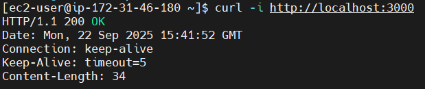

# Node.js CI/CD Pipeline with GitHub Actions and Docker
## TASK 1
---

This project demonstrates a CI/CD pipeline to automatically build, test, push, and deploy a Dockerized Node.js application using:  

1) Node.js – simple HTTP server  
2) GitHub Actions – CI/CD automation  
3) Docker & DockerHub – containerization and image registry  
4) Amazon EC2 – deployment   

---

## Folder Structure

nodejs-demo-app/  
├── .github/  
│   └── workflows/  
│       └── main.yml  
├── screenshots/  
│   ├── github-actions-success.png  
│   ├── browser-response.png  
│   ├── dockerhub-image.png  
│   └── curl-response.png   
├── Dockerfile  
├── index.js  
├── README.md  
└── package.json  

## CI/CD Pipeline Flow 

1) Push code to the main branch.  
2) GitHub Actions builds the Docker image and pushes it to DockerHub.   
3) EC2 instance pulls the image and deploys the app using Docker.  

## Screenshots

GitHub Actions Workflow – Success
Shows a successful CI/CD run triggered by a push to the main branch.
 

---

App Output – Browser
Confirms the app is running successfully on port 3000.

---

App Output – Curl
Confirms the app is running successfully on EC2 at port 3000.

---

DockerHub – Image Pushed
Docker image is available on DockerHub after CI/CD completion.

---

## Live on EC2

**Access via**: `http://<your-ec2-public-ip>:3000`
